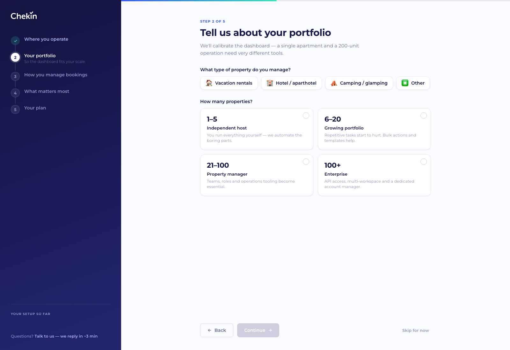
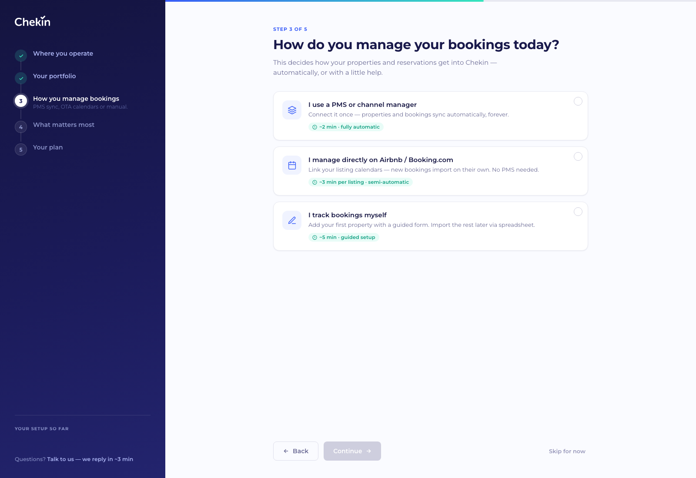
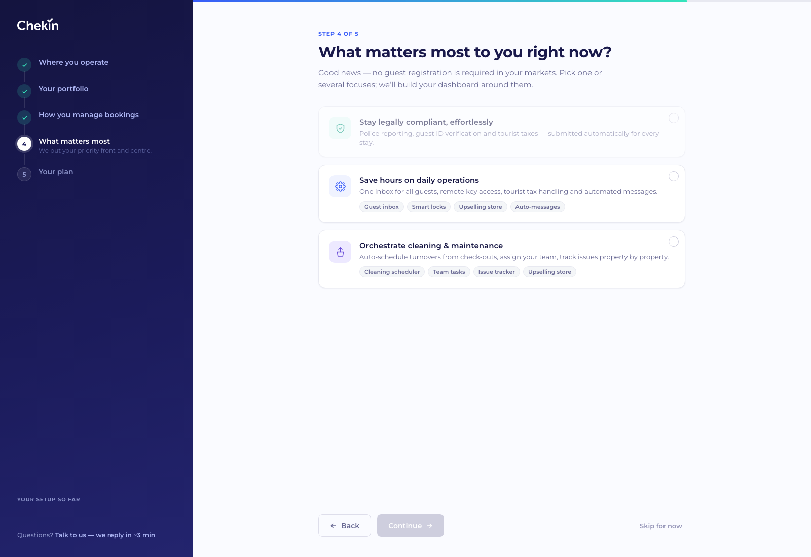
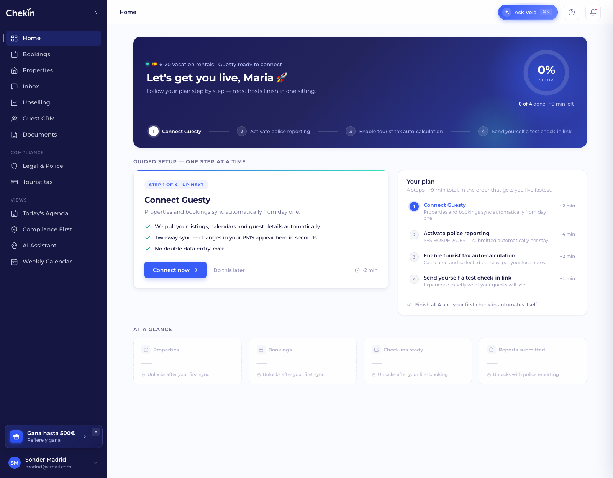
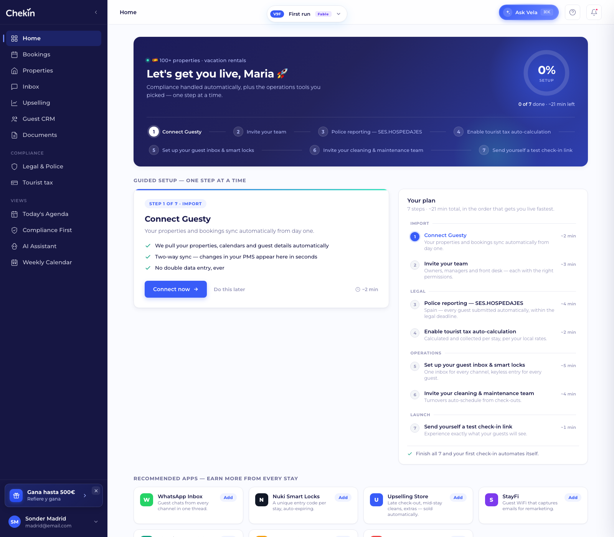

# PRD — Onboarding adaptativo + First-run Home (Chekin Dashboard)

**Audiencia:** Frontend dev · **Estado:** Prototipo funcional aprobado para implementación · **Fecha:** 19 jul 2026
**Prototipo vivo:** https://carloslagares.github.io/chekin-dashboard-preview/
**Código de referencia:** [`onboarding.html`](onboarding.html) · [`variants/v9_firstrun.html`](variants/v9_firstrun.html) (HTML/CSS/JS vanilla; recrear en el stack del producto, no copiar la estructura interna)

---

## 1. Problema y objetivo

El 80% del negocio está en Europa (mercados con obligación legal de registro de viajeros), pero vendemos también en mercados sin compliance donde el valor es **revenue y operaciones**. Hoy el dashboard es único para todos. Objetivo:

1. **Onboarding de ~60 segundos** que capture 5 datos (localización, tipo de propiedad, tamaño, gestión de reservas, prioridades).
2. Con esos datos, **generar un plan de setup personalizado** (pasos ordenados con estimación de tiempo).
3. Aterrizar en una **First-run Home** que trabaja ese plan **paso a paso** y que adapta vocabulario, copys, KPIs y apps al segmento.
4. Al completar el plan → transición al dashboard estándar ("live mode").

### Principios de diseño (decisiones ya tomadas — no reabrir sin motivo)

- **Localización primero, ICP después.** El compliance no es una preferencia del usuario: lo determina el país. Nunca dejamos que el usuario "opte por no cumplir la ley" eligiendo otro foco. Los 3 ICP (compliance-heavy / operations / cleaning) se preguntan como *focos* en el paso 4, en lenguaje de resultados, no de segmentos internos.
- **Focos multi-selección.** Un PM de 100 propiedades puede ser compliance + ops + cleaning a la vez.
- **Compliance bloqueado.** Si algún país seleccionado es regulado, el foco "compliance" aparece marcado, en verde, con chip "Required in your market", y **no es deseleccionable**. Si ningún país es regulado, la tarjeta aparece atenuada (dim) y no seleccionable.
- **Tres caminos de import, no dos.** PMS (sync total) / OTA directo vía iCal (semi-auto — evita que el "sin PMS" caiga al camino manual) / Manual (form guiado + CSV).
- **Onboarding full-screen sin sidebar.** El menú lateral aparece por primera vez en la First-run Home.

---

## 2. Arquitectura del prototipo

```
index.html                      ← switcher de variantes (iframe). Default: V8 dashboard
onboarding.html                 ← wizard 5 pasos (sin sidebar)
variants/v8_fable.html          ← dashboard "live" (destino final)
variants/v9_firstrun.html       ← First-run Home (destino post-onboarding)
ds/_sidebar.{js,css}            ← sidebar compartida (bloque de cuenta colapsado por defecto)
```

- El wizard, al pulsar **"Go to my dashboard"**, persiste todo en `localStorage['chekin_onboarding']` y navega a `index.html?view=firstrun`.
- La First-run lee ese JSON; si no existe, usa un fallback demo (España + Guesty).
- **"Skip for now"** en el wizard NO guarda plan y va directo a `?view=fable` (dashboard estándar).
- En producto: sustituir localStorage por API (perfil de workspace) — el contrato de datos de §5 es el payload.

### Parámetros de debug/demo (mantener en el prototipo)

| Parámetro | Dónde | Efecto |
|---|---|---|
| `?step=N` | onboarding.html | Salta al paso N sin validación |
| `?demo=compliance\|ops\|cleaning\|manual\|multi\|all` | onboarding.html | Precarga respuestas y muestra el paso 5 (plan) |
| `?demo=X&go=1` | onboarding.html | Precarga, guarda y aterriza directo en la First-run personalizada |
| `?done=N` | v9_firstrun.html | Renderiza con N pasos ya completados |
| `?view=onboarding\|firstrun\|fable` | index.html | Deep-link a cada vista del switcher |

---

## 3. El wizard — especificación paso a paso

Layout: rail izquierdo oscuro (steps + chips "Your setup so far" que se acumulan en vivo + link a soporte) / contenido a la derecha con barra de progreso superior. Botonera: Back (oculto en paso 1) · Continue (disabled hasta validar) · "Skip for now".

### Paso 1 — Where are your properties?


- Grid de países **multi-select** (12 en el prototipo). Cada tarjeta: bandera, nombre y tag `Legal compliance` (ámbar) o `No registration` (verde). El tag educa desde el primer click.
- Si se selecciona **España** → aparecen chips de región multi-select (Catalonia · Mossos, Basque Country · Ertzaintza, Navarre · Policía Foral). Deseleccionar España limpia las regiones.
- **Validación:** ≥ 1 país.
- Tabla de países del prototipo (fuente de verdad para el plan):

| País | Regulado | Esquema policial | Tasa turística |
|---|---|---|---|
| España | ✅ | SES.HOSPEDAJES (+ regionales) | ✅ |
| Italia | ✅ | Alloggiati Web | ✅ |
| Portugal | ✅ | SIBA / AIMA | ✅ |
| Alemania | ✅ | Meldeschein | ✅ |
| Croacia | ✅ | eVisitor | ✅ |
| Austria | ✅ | Gästeblatt | ✅ |
| Francia | ❌ | — | ✅ |
| Grecia | ❌ | — | ✅ |
| UAE | ❌ | — | ✅ |
| UK / USA / México | ❌ | — | ❌ |

> En producto esta tabla es config de backend (por país/región). El front solo consume `reg`, `scheme`, `tax`.

### Paso 2 — Tell us about your portfolio


Dos sub-preguntas en una pantalla:

1. **Tipo de propiedad** (single-select, chips): 🏠 Vacation rentals · 🏨 Hotel / aparthotel · ⛺ Camping / glamping · ✳️ Other. "Other" despliega input de texto libre (placeholder: "hostel, coliving, marina…").
   - El tipo define el **vocabulario de unidad** en todo lo posterior: `vr/other → properties`, `hotel → rooms`, `camping → units`. La etiqueta de la segunda pregunta cambia en vivo ("How many rooms across your hotels?", "How many units or pitches?").
2. **Tamaño** (single-select, tarjetas): los **rangos, etiquetas y descripciones cambian según el tipo** elegido. Cambiar de tipo re-renderiza las tarjetas y resetea la selección. Cada opción lleva un `sizeTier` (0–3) que es lo que consumen las reglas posteriores (no el string del rango):

| Tier | Vacation rentals / Other | Hotel / aparthotel | Camping / glamping |
|---|---|---|---|
| 0 | 1–5 · Independent host | 1–10 · Guest house | 1–25 · Small site |
| 1 | 6–20 · Growing portfolio | 11–30 · Boutique hotel | 26–75 · Family campsite |
| 2 | 21–100 · Property manager | 31–100 · Independent hotel | 76–200 · Large site |
| 3 | 100+ · Enterprise | 100+ · Hotel group | 200+ · Resort / group |

**Validación:** tipo + tamaño (el texto de "Other" es opcional).

### Paso 3 — How do you manage your bookings today?


Tres tarjetas single-select, cada una con estimación de esfuerzo visible:

| Opción | Sub-flujo | Expectativa |
|---|---|---|
| **I use a PMS or channel manager** | Despliega grid de PMS (Guesty, Hostaway, Lodgify, Smoobu, Avantio, Cloudbeds, Octorate, Other…) — obligatorio elegir uno | "~2 min · fully automatic" |
| **I manage directly on Airbnb / Booking.com** | — | "~3 min per listing · semi-automatic" (import iCal) |
| **I track bookings myself** | — | "~5 min · guided setup" (form + CSV después) |

**Validación:** opción elegida; si PMS, además un PMS del grid.

### Paso 4 — What matters most? (los 3 ICP)


**Multi-select** de focos, formulados como resultados:

1. **Stay legally compliant, effortlessly** — si hay país regulado: bloqueada en verde, chip "Required in your market", título de la pantalla cambia a *"Legal compliance is covered. What else matters?"*. Si no hay país regulado: atenuada y no seleccionable, y el copy celebra: *"Good news — no guest registration is required in your markets."*
2. **Save hours on daily operations** — chips de apps debajo (Guest inbox, Smart locks, Upselling store, Auto-messages).
3. **Orchestrate cleaning & maintenance** — chips (Cleaning scheduler, Team tasks, Issue tracker, Upselling store).

**Validación:** ≥ 1 foco (en mercados regulados, compliance ya cuenta).

### Paso 5 — Here's your plan, Maria


- Izquierda: **checklist numerada** del plan generado (§4) con `~X min` por paso y total ("You can be live in about N minutes").
- Derecha: **preview del dashboard** (mini-hero con greeting contextual + primeros 4 pasos del rail, chips de módulos activados, y fila "Recommended apps" solo si hay foco ops/cleaning).
- El lead cambia según el segmento (compliance vs "no legal paperwork… straight to revenue").
- CTA **"Go to my dashboard"** → guarda (§5) y navega a First-run.

---

## 4. Generación del plan (algoritmo)

Orden fijo — es también el orden en que la First-run propone trabajar:

```
1. Import   → 1 paso según manage:
              pms    → "Connect {PMS}"                     (~2 min)
              ota    → "Link your Airbnb & Booking.com calendars" (~3 min)
              manual → "Add your first property"           (~5 min)
2. Import   → si sizeTier ≥ 2 (dos tiers superiores): "Invite your team" (~3 min)
3. Legal    → UN paso por CADA país regulado:
              "Police reporting — {scheme}" (~4 min)       ← ES incluye "+ regiones" en la descripción
4. Legal    → si algún país tiene tasa: "Enable tourist tax auto-calculation" (~2 min)
5. Operations → si foco ops:      "Set up your guest inbox & smart locks" (~5 min)
6. Operations → si foco cleaning: "Invite your cleaning & maintenance team" (~4 min)
7. Launch   → siempre: "Send yourself a test check-in link" (~1 min)
```

Cada paso lleva: `k` (clave de tipo), `phase` (Import/Legal/Operations/Launch), `t` (título), `d` (descripción), `eta` (min) y, en police, `scheme` + `country`.

---

## 5. Contrato de datos (`localStorage['chekin_onboarding']`)

```json
{
  "countries": [{ "code":"ES", "name":"Spain", "flag":"🇪🇸", "reg":true, "scheme":"SES.HOSPEDAJES", "tax":true }],
  "regions": ["Catalonia"],
  "ptype": "vr",              // vr | hotel | camping | other
  "ptypeOther": "",           // texto libre si ptype=other
  "unit": "properties",       // properties | rooms | units  (derivado de ptype)
  "size": "6-20",             // string del rango — depende del tipo (ver tabla de tiers en §3)
  "sizeTier": 1,              // 0-3 — usar ESTE para reglas (team step, tono enterprise)
  "manage": "pms",            // pms | ota | manual
  "pms": "Guesty",            // nombre o null
  "prios": ["compliance"],    // subset de: compliance | ops | cleaning
  "steps": [ { "k":"pms", "phase":"Import", "t":"Connect Guesty", "d":"…", "eta":2 } ],
  "mods":  ["checkin","id","guestapp","police","tax"]   // módulos a activar
}
```

---

## 6. First-run Home — especificación



Estructura (de arriba a abajo):

1. **Hero** (gradiente oscuro): greeting contextual (`🇪🇸 6-20 properties · vacation rentals`), H1 + sub **según segmento** (§6.1), anillo de progreso (`done/total`, % con transición animada, "~N min left") y **rail horizontal con TODOS los pasos del plan** (done ✓ verde / activo blanco / pendientes numerados).
2. **Guided setup — one step at a time**: tarjeta grande con SOLO el paso actual (chip "Step N of M · {fase}", título, descripción, 3 bullets de qué va a pasar, CTA específico, "Do this later", `~X min`). Al lado, **checklist completo** del plan con estados (hecho = tachado; activo = azul y clickable) — con **headers de fase** cuando el plan tiene ≥ 6 pasos.
3. **Recommended apps** (solo focos ops/cleaning): grid de app-cards con botón "Add". Merge de ambos catálogos sin duplicados si hay dos focos.
4. **At a glance**: 4 KPIs **bloqueados** (borde discontinuo, valor "—", candado + condición de desbloqueo) — composición según segmento (§6.2).

**Estado final:** al completar todos los pasos, la tarjeta guiada pasa a "🎉 You're live!" con CTA "See my live dashboard" → `index.html?view=fable`.

### 6.1 Matriz de copy del hero

| Condición | H1 | Sub |
|---|---|---|
| Regulado (default) | "Let's get you live, Maria 🚀" | "Follow your plan step by step…" |
| Regulado + varios focos | (igual) | "Compliance handled automatically, plus the operations tools you picked…" |
| NO regulado + foco ops | "Let's get you earning more, Maria 💸" | "No legal paperwork in your markets — straight to revenue and saved hours." |
| NO regulado + foco cleaning (sin ops) | "Let's get your operations humming, Maria ✨" | "…flawless turnovers and guest experience." |

### 6.2 KPIs bloqueados por segmento

Siempre: `{Unit}` (Properties/Rooms/Units) · `Bookings` · `Check-ins ready`. El 4º:

| Condición | 4º KPI | Condición de desbloqueo |
|---|---|---|
| Regulado | Reports submitted | "Unlocks with police reporting" |
| No regulado + ops | Upsell revenue | "Unlocks with the Upselling store" |
| No regulado + cleaning | Turnovers scheduled | "Unlocks when your team joins" |
| Resto | Tourist tax collected | "Unlocks with tourist tax" |

Los dos primeros KPIs dicen "Unlocks after your first **sync**" salvo `manage=manual` → "…your first **property**".

### 6.3 Flujos profundos (modales por tipo de paso)

Cada CTA abre un modal con el formulario real del paso. Completar → estado de éxito ✓ (~1s) → cierra y avanza. "Do this later" avanza sin abrir (⚠️ ver §8). Cerrar (X/Esc/backdrop) no avanza.

| `k` | Modal | Campos / contenido | CTA |
|---|---|---|---|
| `pms` | Connect {PMS} | selector de workspace, toggles (importar 12 meses, two-way sync), nota de OAuth | Authorize with {PMS} |
| `ota` | Link listing calendars | inputs iCal Airbnb + Booking, nota de dónde encontrarlos | Import calendars |
| `manual` | Add your first property | nombre, país, ciudad, dirección, dormitorios, huéspedes máx; nota CSV | Add property |
| `team` | Invite your team | textarea emails, selector de rol (Owner/Manager/Front desk) | Send invitations |
| `police` | Set up {scheme} | usuario + contraseña del organismo, código de establecimiento; nota "no tienes credenciales → te guiamos" | Activate reporting |
| `tax` | Enable tourist tax | municipio (auto por dirección), toggles (cobrar en check-in, resúmenes) | Enable tourist tax |
| `ops` | Inbox & smart locks | toggles: inbox unificado, WhatsApp, locks (Nuki/Yale/TTLock), auto-messages | Set up selected |
| `cleaning` | Invite cleaning team | textarea emails, toggles (auto-turnover, fotos, issues) | Invite team |
| `test` | Test check-in link | email prellenado | Send me the test link |

---

## 7. Casuística — casos de uso uno a uno

> Todos los links usan base `https://carloslagares.github.io/chekin-dashboard-preview/`.

### Caso 1 · Compliance heavy con PMS (el 80% del negocio)
**Quién:** gestor europeo, p.ej. España+Italia, vacation rentals, 6–20, Guesty, foco compliance.
**Demo:** [`onboarding.html?demo=compliance&go=1`](https://carloslagares.github.io/chekin-dashboard-preview/onboarding.html?demo=compliance&go=1)
**Plan generado:** Connect Guesty → Police SES.HOSPEDAJES (+ Catalonia) → Police Alloggiati Web → Tourist tax → Test link.
**Personalización:** compliance bloqueado en paso 4; KPI "Reports submitted"; sin sección de apps.


### Caso 2 · Ops / revenue sin compliance
**Quién:** hotel/aparthotel en UAE+USA, 21–100 rooms, Hostaway, foco operaciones.
**Demo:** [`onboarding.html?demo=ops&go=1`](https://carloslagares.github.io/chekin-dashboard-preview/onboarding.html?demo=ops&go=1)
**Plan:** Connect Hostaway → Invite your team (21+) → Tourist tax (UAE) → Inbox & smart locks → Test.
**Personalización:** hero "earning more 💸"; vocabulario **rooms**; tarjeta compliance atenuada en paso 4; sección **Recommended apps** (WhatsApp Inbox, Nuki, Upselling Store, StayFi); KPI "Upsell revenue".


### Caso 3 · Cleaning con OTA directo (sin PMS)
**Quién:** camping/glamping UK, 6–20 units, gestiona en Airbnb/Booking, foco limpieza.
**Demo:** [`onboarding.html?demo=cleaning&go=1`](https://carloslagares.github.io/chekin-dashboard-preview/onboarding.html?demo=cleaning&go=1)
**Plan:** Link iCal calendars → Invite cleaning team → Test. (Sin pasos legales ni tasa: UK.)
**Personalización:** hero "operations humming ✨"; vocabulario **units**; apps de limpieza primero; KPI "Turnovers scheduled".


### Caso 4 · Manual puro (máxima fricción — cuidar copys)
**Quién:** host pequeño en Francia, 1–5 properties, sin PMS ni ganas, foco ops.
**Demo:** [`onboarding.html?demo=manual&go=1`](https://carloslagares.github.io/chekin-dashboard-preview/onboarding.html?demo=manual&go=1)
**Plan:** Add your first property (form 5 campos + nota CSV) → Tourist tax (FR tiene tasa aunque no registro) → Inbox & locks → Test.
**Personalización:** KPIs "Unlocks after your first **property**" (no "sync"); modal de alta de propiedad como primer paso.


### Caso 5 · Multi-país (un paso de police por esquema)
**Quién:** PM con España (incl. Catalonia) + Italia + Portugal, 21–100, Guesty, compliance.
**Demo:** [`onboarding.html?demo=multi&go=1`](https://carloslagares.github.io/chekin-dashboard-preview/onboarding.html?demo=multi&go=1)
**Plan (7 pasos):** Connect Guesty → Invite team → Police SES (Spain + Catalonia) → Police Alloggiati (Italy) → Police SIBA/AIMA (Portugal) → Tourist tax → Test.
**Personalización:** cada police con su modal de credenciales propio; checklist **agrupado por fases** (≥6 pasos).


### Caso 6 · Enterprise multi-foco (los tres ICP a la vez)
**Quién:** 100+ properties en España, Guesty, focos compliance + ops + cleaning.
**Demo:** [`onboarding.html?demo=all&go=1`](https://carloslagares.github.io/chekin-dashboard-preview/onboarding.html?demo=all&go=1)
**Plan (7 pasos, ~21 min):** Guesty → Team → Police SES → Tax → Inbox & locks → Cleaning team → Test, agrupado Import/Legal/Operations/Launch.
**Personalización:** sub del hero "Compliance handled automatically, plus the operations tools you picked"; apps de ops+cleaning fusionadas sin duplicados (Upselling Store una sola vez).


### Transversales (aplican a todos los casos)
- **Vocabulario por tipo de propiedad** (§3 paso 2, §6.2).
- **Flujos profundos** (§6.3).
- **Skip:** "Skip for now" (wizard) → dashboard estándar sin plan. "Do this later" (first-run) → avanza el paso (ver §8).

---

## 8. Edge cases y decisiones pendientes (para diseño/producto)

1. **"Do this later" avanza como si estuviera hecho.** En el prototipo no hay backlog de pospuestos. En producto: marcar como `skipped`, no como `done`; el anillo no debería sumar skipped, y los pasos legales **no deberían poder saltarse indefinidamente** (banner persistente de riesgo).
2. **Volver atrás en el wizard tras cambiar país:** si deseleccionas todos los regulados, el foco compliance se retira de `prios` automáticamente (implementado). Revisar el caso inverso (añadir país regulado después del paso 4 → compliance se re-bloquea al volver a pasar por el paso 4).
3. **Persistencia:** localStorage es solo del prototipo. En producto, el plan vive en el workspace y se comparte entre dispositivos/usuarios; el estado done/skipped por paso también.
4. **i18n:** todo el copy del prototipo está en inglés; las claves de país/esquema deben venir de backend localizado.
5. **Reanudación:** si el usuario abandona a mitad de wizard, en producto se retoma donde lo dejó (el prototipo no persiste pasos intermedios).
6. **"Other" property type:** hoy solo texto libre informativo; decidir si mapea a vocabulario propio o hereda "properties".
7. **Regiones:** solo España tiene regiones en el prototipo; Italia (provincias con Questura) podría necesitar lo mismo.

---

## 9. Changelog del prototipo (commits relevantes, rama `main`)

| Commit | Contenido |
|---|---|
| `bffc2ba` | V8 Fable Home: hero+stepper fusionados, CTAs en hero, sidebar refinada, **bloque de cuenta colapsado por defecto** |
| `e777700` | Bookings & Properties: tokens V8, KPIs clicables como filtros rápidos, fechas demo coherentes |
| `0a12e6d` | Wizard de onboarding v1 (5 pasos) + entrada en el switcher; default del preview = dashboard V8 |
| `557ecf5` | Pregunta de **tipo de propiedad**; persistencia del plan; **First-run Home** v1 (guided setup paso a paso) |
| `e2e7dae` | Personalizaciones completas: vocabulario, police por país, team/fases enterprise, hero/KPIs/apps por segmento, **modales de flujo profundo**, presets de demo |

---

## 10. Checklist de implementación sugerido (frontend)

- [ ] Wizard: 5 pasos + validaciones + rail de progreso con chips en vivo (§3)
- [ ] Config de países (backend): `reg / scheme / tax` por país y región (§3.1)
- [ ] Generador de plan como función pura sobre el contrato de §5 (§4) — testeable en unidad
- [ ] First-run Home: hero + rail dinámico + guided card + checklist con fases (§6)
- [ ] Matrices de personalización: copy hero (§6.1), 4º KPI (§6.2), apps por foco (§6.3)
- [ ] Modales de flujo por `k` (§6.3) con estados: form → success → advance
- [ ] Estados `done / skipped / active` por paso, persistidos en workspace (§8.1)
- [ ] Transición first-run → dashboard live al completar el plan
