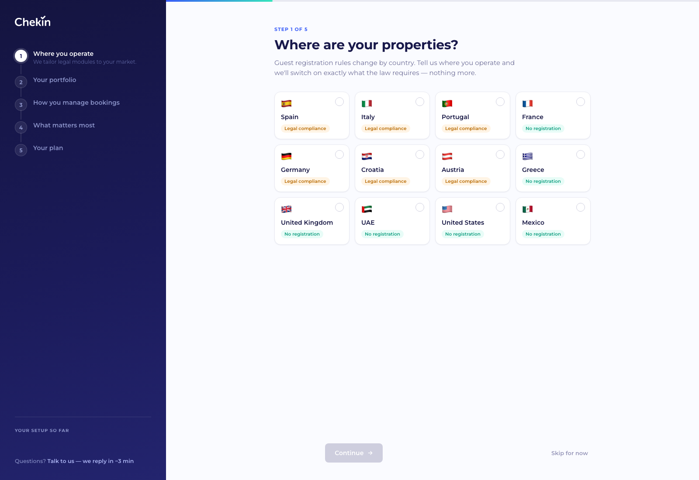
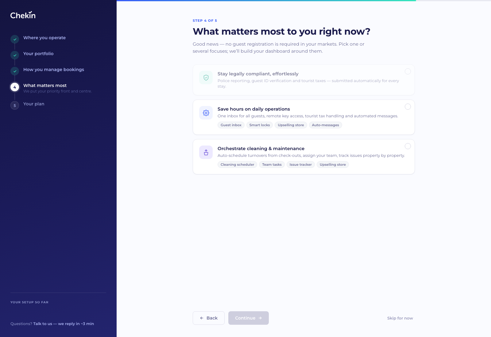
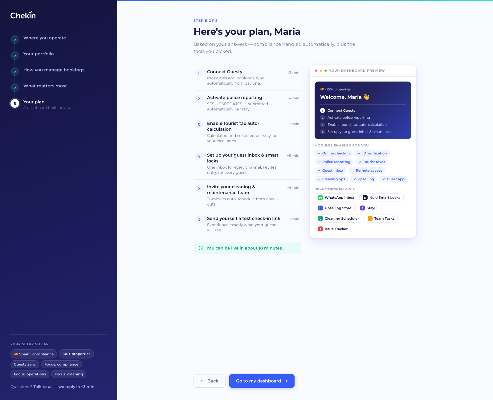
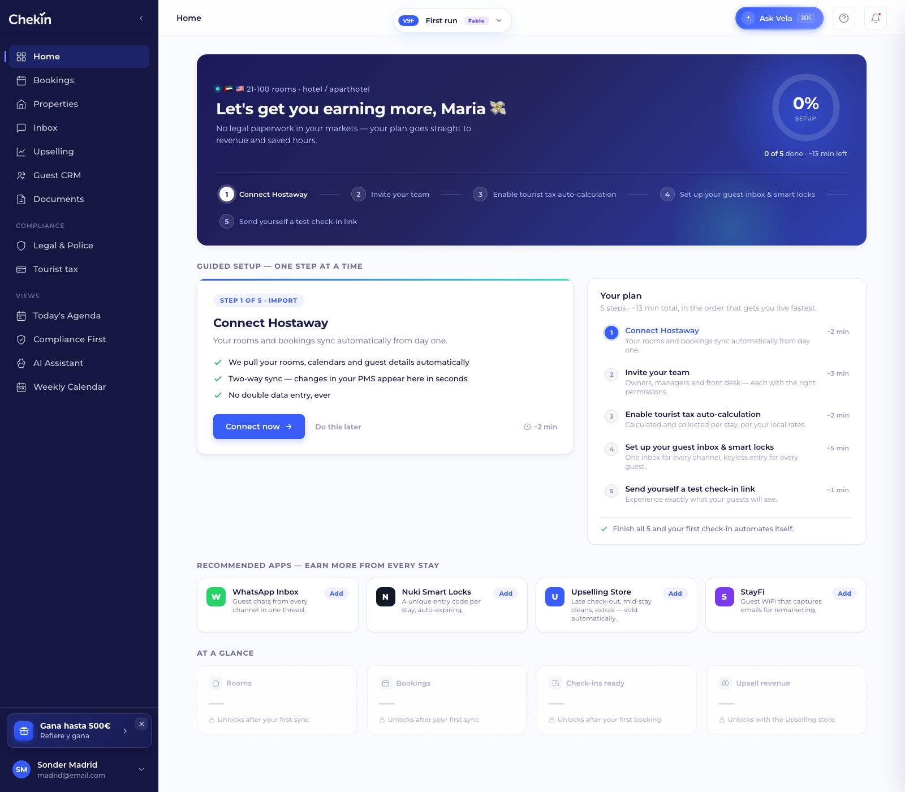
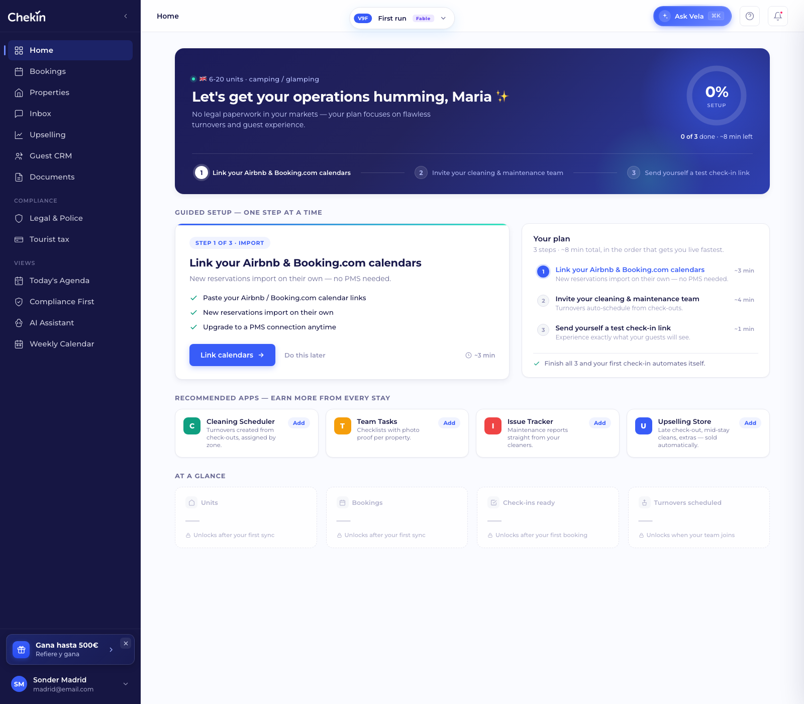
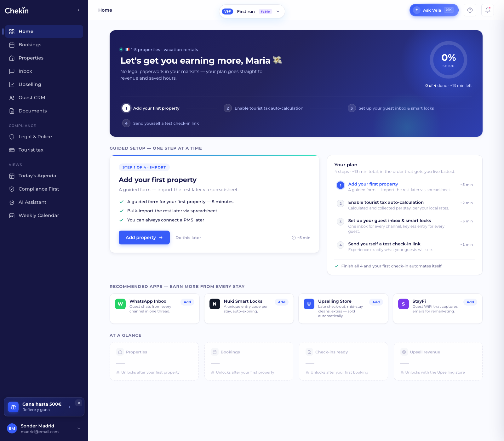

# PRD — Adaptive Onboarding + First-run Home (Chekin Dashboard)

**Audience:** Frontend dev · **Status:** Working prototype approved for implementation · **Date:** Jul 19, 2026
**Live prototype:** https://carloslagares.github.io/chekin-dashboard-preview/
**Reference code:** [`dashboard/onboarding.html`](../dashboard/onboarding.html) · [`dashboard/variants/v9_firstrun.html`](../dashboard/variants/v9_firstrun.html) (vanilla HTML/CSS/JS; recreate in the product stack, do not copy internal structure)

---

## 1. Problem and goal

80% of the business is in Europe (markets with a legal obligation to register guests), but we also sell in markets without compliance requirements where the value is **revenue and operations**. Today the dashboard is one-size-fits-all. Goals:

1. A **~60-second onboarding** capturing 5 data points (location, property type, portfolio size, booking management, priorities).
2. From those answers, **generate a personalized setup plan** (ordered steps with time estimates).
3. Land on a **First-run Home** that works that plan **step by step**, adapting vocabulary, copy, KPIs and apps to the segment.
4. When the plan is complete → transition to the standard dashboard ("live mode").

### Design principles (decided — do not reopen without cause)

- **Location first, ICP later.** Compliance is not a user preference: the country determines it. We never let a user "opt out of the law" by picking another focus. The 3 ICPs (compliance-heavy / operations / cleaning) are asked as *focuses* in step 4, phrased as outcomes, not internal segment names.
- **Multi-select focuses.** A 100-property PM can be compliance + ops + cleaning at once.
- **Compliance locked.** If any selected country is regulated, the "compliance" focus renders checked, in green, with a "Required in your market" chip, and **cannot be deselected**. With no regulated country, the card renders dimmed and non-selectable.
- **Three import paths, not two.** PMS (full sync) / direct OTA via iCal (semi-auto — keeps the "no PMS" crowd out of the manual pit) / Manual (guided form + CSV).
- **Full-screen onboarding, no sidebar.** The side menu appears for the first time on the First-run Home.

---

## 2. Prototype architecture

```
dashboard/index.html            ← variant switcher (iframe). Default: V8 dashboard
dashboard/onboarding.html       ← 5-step wizard (no sidebar)
dashboard/variants/v8_fable.html    ← "live" dashboard (final destination)
dashboard/variants/v9_firstrun.html ← First-run Home (post-onboarding landing)
dashboard/ds/_sidebar.{js,css}  ← shared sidebar (account block collapsed by default)
dashboard/guest-crm/            ← Guest CRM module (self-contained capability)
```

- On **"Go to my dashboard"**, the wizard persists everything to `localStorage['chekin_onboarding']` and navigates to `index.html?view=firstrun`.
- The First-run reads that JSON; if missing, it uses a demo fallback (Spain + Guesty).
- **"Skip for now"** in the wizard does NOT save a plan and goes straight to `?view=fable` (standard dashboard).
- In production: replace localStorage with an API (workspace profile) — the data contract in §5 is the payload.

### Debug/demo parameters (keep in the prototype)

| Parameter | Where | Effect |
|---|---|---|
| `?step=N` | onboarding.html | Jump straight to step N, no validation |
| `?demo=compliance\|ops\|cleaning\|manual\|multi\|all` | onboarding.html | Preload answers and show step 5 (plan) |
| `?demo=X&go=1` | onboarding.html | Preload, save and land directly on the personalized First-run |
| `?done=N` | v9_firstrun.html | Render with N steps already completed |
| `?view=onboarding\|firstrun\|fable` | index.html | Deep-link to each switcher view |

---

## 3. The wizard — step-by-step spec

Layout: dark left rail (step list + live "Your setup so far" chips + support link) / content on the right with a top progress bar. Footer: Back (hidden on step 1) · Continue (disabled until valid) · "Skip for now".

### Step 1 — Where are your properties?


- **Multi-select** country grid (12 in the prototype). Each card: flag, name and a `Legal compliance` (amber) or `No registration` (green) tag. The tag educates from the first click.
- Selecting **Spain** reveals multi-select region chips (Catalonia · Mossos, Basque Country · Ertzaintza, Navarre · Policía Foral). Deselecting Spain clears the regions.
- **Validation:** ≥ 1 country.
- Prototype country table (source of truth for the plan):

| Country | Regulated | Police scheme | Tourist tax |
|---|---|---|---|
| Spain | ✅ | SES.HOSPEDAJES (+ regional) | ✅ |
| Italy | ✅ | Alloggiati Web | ✅ |
| Portugal | ✅ | SIBA / AIMA | ✅ |
| Germany | ✅ | Meldeschein | ✅ |
| Croatia | ✅ | eVisitor | ✅ |
| Austria | ✅ | Gästeblatt | ✅ |
| France | ❌ | — | ✅ |
| Greece | ❌ | — | ✅ |
| UAE | ❌ | — | ✅ |
| UK / USA / Mexico | ❌ | — | ❌ |

> In production this table is backend config (per country/region). The front only consumes `reg`, `scheme`, `tax`.

### Step 2 — Tell us about your portfolio


Two sub-questions on one screen:

1. **Property type** (single-select chips): 🏠 Vacation rentals · 🏨 Hotel / aparthotel · ⛺ Camping / glamping · ✳️ Other. "Other" reveals a free-text input (placeholder: "hostel, coliving, marina…").
   - The type sets the **unit vocabulary** everywhere downstream: `vr/other → properties`, `hotel → rooms`, `camping → units`. The size question label updates live ("How many rooms across your hotels?", "How many units or pitches?").
2. **Size** (single-select cards): **ranges, labels and descriptions change with the selected type**. Changing type re-renders the cards and resets the selection. Each option carries a `sizeTier` (0–3), which is what downstream rules consume (not the range string):

| Tier | Vacation rentals / Other | Hotel / aparthotel | Camping / glamping |
|---|---|---|---|
| 0 | 1–5 · Independent host | 1–10 · Guest house | 1–25 · Small site |
| 1 | 6–20 · Growing portfolio | 11–30 · Boutique hotel | 26–75 · Family campsite |
| 2 | 21–100 · Property manager | 31–100 · Independent hotel | 76–200 · Large site |
| 3 | 100+ · Enterprise | 100+ · Hotel group | 200+ · Resort / group |

**Validation:** type + size ("Other" free text is optional).

### Step 3 — How do you manage your bookings today?


Three single-select cards, each with a visible effort estimate:

| Option | Sub-flow | Expectation |
|---|---|---|
| **I use a PMS or channel manager** | Reveals PMS grid (Guesty, Hostaway, Lodgify, Smoobu, Avantio, Cloudbeds, Octorate, Other…) — picking one is required | "~2 min · fully automatic" |
| **I manage directly on Airbnb / Booking.com** | — | "~3 min per listing · semi-automatic" (iCal import) |
| **I track bookings myself** | — | "~5 min · guided setup" (form + CSV later) |

**Validation:** an option; if PMS, also a PMS from the grid.

### Step 4 — What matters most? (the 3 ICPs)


**Multi-select** focuses, phrased as outcomes:

1. **Stay legally compliant, effortlessly** — with a regulated country: locked in green, "Required in your market" chip, screen title becomes *"Legal compliance is covered. What else matters?"*. With no regulated country: dimmed and non-selectable, and the copy celebrates: *"Good news — no guest registration is required in your markets."*
2. **Save hours on daily operations** — app chips underneath (Guest inbox, Smart locks, Upselling store, Auto-messages).
3. **Orchestrate cleaning & maintenance** — chips (Cleaning scheduler, Team tasks, Issue tracker, Upselling store).

**Validation:** ≥ 1 focus (in regulated markets, compliance already counts).

### Step 5 — Here's your plan, Maria


- Left: **numbered checklist** of the generated plan (§4) with `~X min` per step and total ("You can be live in about N minutes").
- Right: **dashboard preview** (mini-hero with contextual greeting + first 4 rail steps, enabled-module chips, and a "Recommended apps" row only with an ops/cleaning focus).
- The lead changes per segment (compliance vs "no legal paperwork… straight to revenue").
- **"Go to my dashboard"** CTA → saves (§5) and navigates to the First-run.

---

## 4. Plan generation (algorithm)

Fixed order — also the order in which the First-run proposes to work the steps:

```
1. Import   → 1 step per manage:
              pms    → "Connect {PMS}"                            (~2 min)
              ota    → "Link your Airbnb & Booking.com calendars" (~3 min)
              manual → "Add your first property"                  (~5 min)
2. Import   → if sizeTier ≥ 2 (top two tiers): "Invite your team" (~3 min)
3. Legal    → ONE step per EACH regulated country:
              "Police reporting — {scheme}" (~4 min)              ← ES appends "+ regions" to the description
4. Legal    → if any country has tax: "Enable tourist tax auto-calculation" (~2 min)
5. Operations → if ops focus:      "Set up your guest inbox & smart locks" (~5 min)
6. Operations → if cleaning focus: "Invite your cleaning & maintenance team" (~4 min)
7. Launch   → always: "Send yourself a test check-in link" (~1 min)
```

Each step carries: `k` (type key), `phase` (Import/Legal/Operations/Launch), `t` (title), `d` (description), `eta` (min) and, for police, `scheme` + `country`.

---

## 5. Data contract (`localStorage['chekin_onboarding']`)

```json
{
  "countries": [{ "code":"ES", "name":"Spain", "flag":"🇪🇸", "reg":true, "scheme":"SES.HOSPEDAJES", "tax":true }],
  "regions": ["Catalonia"],
  "ptype": "vr",              // vr | hotel | camping | other
  "ptypeOther": "",           // free text when ptype=other
  "unit": "properties",       // properties | rooms | units  (derived from ptype)
  "size": "6-20",             // range string — depends on type (see tier table in §3)
  "sizeTier": 1,              // 0-3 — use THIS for rules (team step, enterprise tone)
  "manage": "pms",            // pms | ota | manual
  "pms": "Guesty",            // name or null
  "prios": ["compliance"],    // subset of: compliance | ops | cleaning
  "steps": [ { "k":"pms", "phase":"Import", "t":"Connect Guesty", "d":"…", "eta":2 } ],
  "mods":  ["checkin","id","guestapp","police","tax"]   // modules to enable
}
```

---

## 6. First-run Home — spec


Structure (top to bottom):

1. **Hero** (dark gradient): contextual greeting (`🇪🇸 6-20 properties · vacation rentals`), H1 + sub **per segment** (§6.1), progress ring (`done/total`, animated %, "~N min left") and a **horizontal rail with ALL the plan steps** (done ✓ green / active white / pending numbered).
2. **Guided setup — one step at a time**: a large card with ONLY the current step ("Step N of M · {phase}" chip, title, description, 3 bullets of what will happen, specific CTA, "Do this later", `~X min`). Next to it, the **full plan checklist** with states (done = strikethrough; active = blue and clickable) — with **phase headers** when the plan has ≥ 6 steps.
3. **Recommended apps** (ops/cleaning focuses only): app-card grid with an "Add" button. Both catalogs merge without duplicates when two focuses are picked.
4. **At a glance**: 4 **locked** KPIs (dashed border, "—" value, padlock + unlock condition) — composition per segment (§6.2).

**Final state:** with every step done, the guided card becomes "🎉 You're live!" with a "See my live dashboard" CTA → `index.html?view=fable`.

### 6.1 Hero copy matrix

| Condition | H1 | Sub |
|---|---|---|
| Regulated (default) | "Let's get you live, Maria 🚀" | "Follow your plan step by step…" |
| Regulated + several focuses | (same) | "Compliance handled automatically, plus the operations tools you picked…" |
| NOT regulated + ops focus | "Let's get you earning more, Maria 💸" | "No legal paperwork in your markets — straight to revenue and saved hours." |
| NOT regulated + cleaning only | "Let's get your operations humming, Maria ✨" | "…flawless turnovers and guest experience." |

### 6.2 Locked KPIs per segment

Always: `{Unit}` (Properties/Rooms/Units) · `Bookings` · `Check-ins ready`. The 4th:

| Condition | 4th KPI | Unlock condition |
|---|---|---|
| Regulated | Reports submitted | "Unlocks with police reporting" |
| Not regulated + ops | Upsell revenue | "Unlocks with the Upselling store" |
| Not regulated + cleaning | Turnovers scheduled | "Unlocks when your team joins" |
| Otherwise | Tourist tax collected | "Unlocks with tourist tax" |

The first two KPIs read "Unlocks after your first **sync**" except `manage=manual` → "…your first **property**".

### 6.3 Deep flows (modals per step type)

Each CTA opens a modal with the step's real form. Completing it → success state ✓ (~1s) → closes and advances. "Do this later" advances without opening (⚠️ see §8). Closing (X/Esc/backdrop) does not advance.

| `k` | Modal | Fields / content | CTA |
|---|---|---|---|
| `pms` | Connect {PMS} | workspace selector, toggles (import 12 months, two-way sync), OAuth note | Authorize with {PMS} |
| `ota` | Link listing calendars | Airbnb + Booking iCal inputs, where-to-find-it note | Import calendars |
| `manual` | Add your first property | name, country, city, address, bedrooms, max guests; CSV note | Add property |
| `team` | Invite your team | emails textarea, role selector (Owner/Manager/Front desk) | Send invitations |
| `police` | Set up {scheme} | authority username + password, establishment code; "no credentials yet → we guide you" note | Activate reporting |
| `tax` | Enable tourist tax | municipality (auto from address), toggles (collect at check-in, summaries) | Enable tourist tax |
| `ops` | Inbox & smart locks | toggles: unified inbox, WhatsApp, locks (Nuki/Yale/TTLock), auto-messages | Set up selected |
| `cleaning` | Invite cleaning team | emails textarea, toggles (auto-turnover, photos, issues) | Invite team |
| `test` | Test check-in link | prefilled email | Send me the test link |

---

## 7. Casuistry — use cases one by one

> All links use base `https://carloslagares.github.io/chekin-dashboard-preview/dashboard/`.

### Case 1 · Compliance heavy with PMS (80% of the business)
**Who:** European manager, e.g. Spain+Italy, vacation rentals, 6–20, Guesty, compliance focus.
**Demo:** [`onboarding.html?demo=compliance&go=1`](https://carloslagares.github.io/chekin-dashboard-preview/dashboard/onboarding.html?demo=compliance&go=1)
**Generated plan:** Connect Guesty → Police SES.HOSPEDAJES (+ Catalonia) → Police Alloggiati Web → Tourist tax → Test link.
**Personalization:** compliance locked at step 4; "Reports submitted" KPI; no apps section.


### Case 2 · Ops / revenue without compliance
**Who:** hotel/aparthotel in UAE+USA, 31–100 rooms, Hostaway, operations focus.
**Demo:** [`onboarding.html?demo=ops&go=1`](https://carloslagares.github.io/chekin-dashboard-preview/dashboard/onboarding.html?demo=ops&go=1)
**Plan:** Connect Hostaway → Invite your team (tier ≥ 2) → Tourist tax (UAE) → Inbox & smart locks → Test.
**Personalization:** "earning more 💸" hero; **rooms** vocabulary; dimmed compliance card at step 4; **Recommended apps** section (WhatsApp Inbox, Nuki, Upselling Store, StayFi); "Upsell revenue" KPI.


### Case 3 · Cleaning with direct OTA (no PMS)
**Who:** camping/glamping UK, 26–75 units, manages on Airbnb/Booking, cleaning focus.
**Demo:** [`onboarding.html?demo=cleaning&go=1`](https://carloslagares.github.io/chekin-dashboard-preview/dashboard/onboarding.html?demo=cleaning&go=1)
**Plan:** Link iCal calendars → Invite cleaning team → Test. (No legal steps or tax: UK.)
**Personalization:** "operations humming ✨" hero; **units** vocabulary; cleaning apps first; "Turnovers scheduled" KPI.


### Case 4 · Pure manual (highest friction — mind the copy)
**Who:** small host in France, 1–5 properties, no PMS and no plans for one, ops focus.
**Demo:** [`onboarding.html?demo=manual&go=1`](https://carloslagares.github.io/chekin-dashboard-preview/dashboard/onboarding.html?demo=manual&go=1)
**Plan:** Add your first property (5-field form + CSV note) → Tourist tax (FR has tax without registration) → Inbox & locks → Test.
**Personalization:** KPIs read "Unlocks after your first **property**" (not "sync"); the add-property modal is step 1.


### Case 5 · Multi-country (one police step per scheme)
**Who:** PM with Spain (incl. Catalonia) + Italy + Portugal, 21–100, Guesty, compliance.
**Demo:** [`onboarding.html?demo=multi&go=1`](https://carloslagares.github.io/chekin-dashboard-preview/dashboard/onboarding.html?demo=multi&go=1)
**Plan (7 steps):** Connect Guesty → Invite team → Police SES (Spain + Catalonia) → Police Alloggiati (Italy) → Police SIBA/AIMA (Portugal) → Tourist tax → Test.
**Personalization:** each police step has its own credentials modal; checklist **grouped by phase** (≥6 steps).


### Case 6 · Enterprise multi-focus (all three ICPs)
**Who:** 100+ properties in Spain, Guesty, compliance + ops + cleaning focuses.
**Demo:** [`onboarding.html?demo=all&go=1`](https://carloslagares.github.io/chekin-dashboard-preview/dashboard/onboarding.html?demo=all&go=1)
**Plan (7 steps, ~21 min):** Guesty → Team → Police SES → Tax → Inbox & locks → Cleaning team → Test, grouped Import/Legal/Operations/Launch.
**Personalization:** hero sub "Compliance handled automatically, plus the operations tools you picked"; ops+cleaning apps merged without duplicates (Upselling Store appears once).


### Cross-cutting (applies to every case)
- **Vocabulary per property type** (§3 step 2, §6.2).
- **Deep flows** (§6.3).
- **Skip:** "Skip for now" (wizard) → standard dashboard, no plan. "Do this later" (first-run) → advances the step (see §8).

---

## 8. Edge cases and open product decisions

1. **"Do this later" advances as if done.** The prototype has no postponed backlog. In production: mark as `skipped`, not `done`; the ring should not count skipped, and legal steps **must not be skippable indefinitely** (persistent risk banner).
2. **Going back in the wizard after changing countries:** deselecting every regulated country removes the compliance focus from `prios` automatically (implemented). Review the inverse (adding a regulated country after step 4 → compliance re-locks when passing step 4 again).
3. **Persistence:** localStorage is prototype-only. In production the plan lives on the workspace and is shared across devices/users; per-step done/skipped state too.
4. **i18n:** all prototype copy is English; country/scheme keys must come from localized backend.
5. **Resume:** if the user abandons mid-wizard, production resumes where they left off (the prototype does not persist intermediate steps).
6. **"Other" property type:** free text is informational today; decide whether it maps to its own vocabulary or inherits "properties".
7. **Regions:** only Spain has regions in the prototype; Italy (Questure per province) may need the same.

---

## 9. Prototype changelog (relevant commits, `main` branch)

| Commit | Contents |
|---|---|
| `bffc2ba` | V8 Fable Home: hero+stepper merged, hero CTAs, refined sidebar, **account block collapsed by default** |
| `e777700` | Bookings & Properties: V8 tokens, KPI cards as quick filters, coherent demo dates |
| `0a12e6d` | Onboarding wizard v1 (5 steps) + switcher entry; preview default = V8 dashboard |
| `557ecf5` | **Property type** question; plan persistence; **First-run Home** v1 (step-by-step guided setup) |
| `e2e7dae` | Full personalizations: vocabulary, police per country, team/phases for enterprise, hero/KPIs/apps per segment, **deep-flow modals**, demo presets |
| `40dbd26` | Size tiers adapt to property type (VR / hotel / camping); `sizeTier` drives downstream rules |

---

## 10. Suggested implementation checklist (frontend)

- [ ] Wizard: 5 steps + validations + progress rail with live chips (§3)
- [ ] Country config (backend): `reg / scheme / tax` per country and region (§3.1)
- [ ] Plan generator as a pure function over the §5 contract (§4) — unit-testable
- [ ] First-run Home: hero + dynamic rail + guided card + phased checklist (§6)
- [ ] Personalization matrices: hero copy (§6.1), 4th KPI (§6.2), apps per focus (§6.3)
- [ ] Flow modals per `k` (§6.3) with states: form → success → advance
- [ ] `done / skipped / active` states per step, persisted on the workspace (§8.1)
- [ ] First-run → live dashboard transition on plan completion
