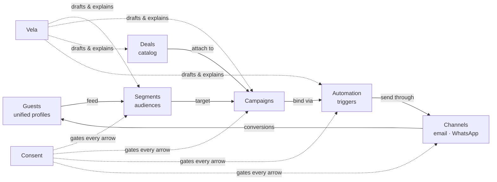
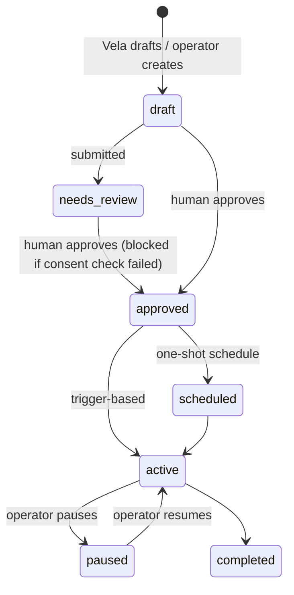
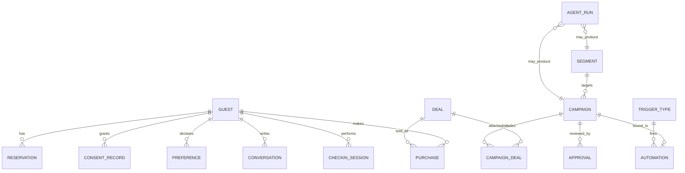

# Chekin Guest CRM — Product Requirements Document

**Status:** Living document · **Owner:** Product (Carlos Lagares) · **Audience:** Engineering, Design, Product
**Scope:** The Guest CRM module as conceived from the ground up — its purpose, architecture, subsystems and how they interlock. Implementation iterations are intentionally out of scope; this describes the product as designed.

---

## Table of contents

1. [Purpose and problem statement](#1-purpose-and-problem-statement)
2. [Product principles](#2-product-principles)
3. [Users and personas](#3-users-and-personas)
4. [System overview and information architecture](#4-system-overview-and-information-architecture)
5. [Vela — the Guest CRM agent](#5-vela--the-guest-crm-agent)
6. [Subsystems in detail](#6-subsystems-in-detail)
   - 6.1 [Overview (home)](#61-overview-home)
   - 6.2 [Guests — the unified profile](#62-guests--the-unified-profile)
   - 6.3 [Opportunity Score](#63-opportunity-score)
   - 6.4 [Segments — natural-language audiences](#64-segments--natural-language-audiences)
   - 6.5 [Campaigns and their lifecycle](#65-campaigns-and-their-lifecycle)
   - 6.6 [Campaign Studio](#66-campaign-studio)
   - 6.7 [Deals — the monetization catalog](#67-deals--the-monetization-catalog)
   - 6.8 [Automation — campaign ↔ trigger bindings](#68-automation--campaign--trigger-bindings)
   - 6.9 [Consent & preferences — the compliance backbone](#69-consent--preferences--the-compliance-backbone)
   - 6.10 [First-run and activation](#610-first-run-and-activation)
7. [Data model](#7-data-model)
8. [Service architecture](#8-service-architecture)
9. [Platform integration — zoom out](#9-platform-integration--zoom-out)
10. [The Automation Engine connection — when / if / then](#10-the-automation-engine-connection--when--if--then)
11. [Success metrics](#11-success-metrics)
12. [Non-goals](#12-non-goals)
13. [Open questions](#13-open-questions)

---

## 1. Purpose and problem statement

Property managers and hoteliers using Chekin already generate a continuous stream of first-party guest data as a **by-product of operations**: reservations, online check-ins, identity verification, inbox conversations, upsell purchases. Today that data is fragmented across operational silos and monetized only opportunistically (per-stay upsells at check-in time).

**The problem:** the guest relationship ends at checkout. There is no persistent profile, no memory of preferences or consent, no way to reach the right guest with the right offer at the right moment — and no way to do any of this at scale without a marketing team the typical property manager does not have.

**Guest CRM** turns Chekin's operational exhaust into a revenue engine:

- Every guest becomes a **unified, persistent profile** assembled automatically — zero data entry.
- An AI agent (**Vela**) detects revenue opportunities, drafts audiences, campaigns and copy from a one-sentence brief.
- A **consent-first compliance layer** makes it structurally impossible to message anyone who hasn't opted in.
- A **human approves everything** before anything sends. The AI proposes; the operator decides.

The one-line pitch: *"Your bookings already know who your best guests are. Guest CRM lets you act on it — in one sentence, with consent built in."*

## 2. Product principles

These principles are load-bearing; features that violate them don't ship.

1. **AI-first, human-approved.** Vela drafts everything (segments, campaigns, copy, deal matching), but nothing reaches a guest without explicit human approval. The approval loop is a feature, not friction — it is what makes an autonomous agent trustworthy in a compliance-sensitive domain.
2. **Consent is structural, not decorative.** Consent checking is not a validation step a developer can forget; it is enforced at the audience-resolution layer. A guest without channel consent *cannot* be part of an eligible audience. Global unsubscribe overrides everything. Some safeguards are hard-locked and cannot be disabled even by admins.
3. **Explainability everywhere.** Every AI output carries its reasoning: segments show the parsed rules, scores list their contributing signals, campaign analytics come with a "Why?". Operators must never have to trust a black box.
4. **Zero data entry.** Profiles, preferences, intents and consent records derive from operations the property already performs (bookings, check-in, inbox). The CRM never asks the operator to type in guest data.
5. **Revenue-denominated.** Every suggestion, campaign and deal is expressed in expected € — the operator prioritizes by money, not by marketing abstractions.

## 3. Users and personas

| Persona | Role | What they need from Guest CRM |
|---|---|---|
| **Property manager (primary)** | Runs 5–200 units, no dedicated marketing staff | One-sentence campaign creation, safe defaults, revenue visibility |
| **Revenue / marketing manager** | Larger operators and hotel groups | Segmentation control, campaign analytics, deal catalog management |
| **Admin / compliance owner** | Legal responsibility for guest communications | Consent audit trail, suppression list, activation safeguards |

All three share one interface; the design collapses gracefully — the property manager can ignore Segments and Consent entirely and still operate safely, because the guardrails are structural.

## 4. System overview and information architecture

Guest CRM is a module inside the Chekin dashboard (sidebar entry `Guest CRM`), organized as seven tabs plus two cross-cutting surfaces:

```
Guest CRM
├── Overview        — command center: Vela hero, KPIs, review queue, opportunities
├── Guests          — unified profile table + guest drawer (cross-cutting)
├── Segments        — natural-language audience builder + saved segments
├── Campaigns       — campaign list, lifecycle management → Campaign Studio + Campaign Detail
├── Deals           — monetization catalog (own + third-party)
├── Automation      — campaign↔trigger bindings on the platform Automation Engine
└── Consent         — compliance backbone: categories, rules, suppression, audit, safeguards
Cross-cutting:
├── Vela            — the agent; reachable from the Overview hero, ⌘K, and embedded in every flow
└── Guest drawer    — full profile panel, opens from any guest reference anywhere in the module
```

**How the sections relate — the core loop:**



Guests feed segments; segments plus deals compose campaigns; campaigns bind to triggers in the Automation Engine; sends produce conversions that enrich the guest profile — closing the loop. Consent gates every arrow. Vela authors drafts at every stage.

## 5. Vela — the Guest CRM agent

Vela is **one agent with one identity** across the entire dashboard ("Ask Vela", ⌘K) and specialized capabilities inside Guest CRM. It is not a chatbot bolted onto a UI; every Vela capability produces a **structured, editable, reviewable artifact**.

### 5.1 Capabilities (agent run types)

| Run type | Input | Output | Where it surfaces |
|---|---|---|---|
| `segment_builder` | Natural-language audience description | Structured rule set + eligibility preview | Segments page |
| `campaign_planner` | One-sentence campaign brief | Full campaign plan: audience, deals, copy, trigger, revenue estimate | Campaign Studio |
| `deal_matching` | An audience (rule set) | Ranked deal recommendations with reasons | Studio step 3, campaign detail |
| `compliance_check` | A campaign | Consent check result: eligible/excluded with per-reason counts | Campaign detail, activation gate |
| `performance_summarizer` | Campaign analytics | Headline + recommendations ("click rate healthy — keep subject") | Campaign detail |
| `guest_summary` | A guest profile | AI headline + recommended next actions with € estimates | Guest drawer |
| `suggestion_engine` | Whole dataset | Ranked revenue opportunities ("42 guests depart Sunday…") | Overview |

### 5.2 Behavioral contract

- **Draft-only:** every Vela output lands in `draft` or `needs_review` state. Vela cannot approve, schedule or send.
- **Traceable:** every run is recorded (`AgentRun`: type, input, output, reasoning summary, author, timestamp) and shown in the Overview "Agent activity" feed. Operators see what the agent did and why.
- **Interruptible:** every generated artifact is editable before approval — rules, copy, deals, triggers.
- **Revenue-ranked:** when Vela proposes multiple things, they are ordered by expected revenue.

### 5.3 Entry points

1. **Overview hero** — the primary invitation: a prompt bar ("Describe a campaign — audience, offer, channel…") with example chips. Submits into Campaign Studio with the prompt pre-loaded.
2. **⌘K / Ask Vela** — global dashboard assistant; inside Guest CRM it shares context with the module.
3. **Embedded** — "Create campaign" buttons on suggestions, segment insights, guest drawer actions, and the filter-aware CTA in the Guests table all compose a prompt and hand it to the Studio. The pattern is uniform: *anything that identifies an audience can become a campaign in one click.*

## 6. Subsystems in detail

### 6.1 Overview (home)

**Purpose:** answer three questions in one glance — *how is guest revenue doing, what has Vela found for me, and what is waiting on me?*

**Composition (top to bottom, left to right):**

1. **Vela hero (command box).** Dark gradient card. Eyebrow `Vela · Guest CRM Agent`, prompt input, Generate button, example chips, "How it works" video chip. This is deliberately the first element: the module's identity is *tell the agent what you want*.
2. **KPI strip** — four outcome metrics with trend context: Campaign revenue (Δ vs previous month), App Sales revenue (Δ), Marketing consent (n/total + coverage %), Active campaigns (+ awaiting-review count). Guest-count stats (total / upcoming / in-house) live inside the Segmentation card, not here — the KPI row is reserved for outcomes, not inventory.
3. **AI suggestions** — Vela's ranked opportunity cards. Each: kind icon (upsell / recover / reactivate), title, evidence sentence ("42 guests depart this Sunday and historically value a slower morning"), metric badge, estimated € badge, and a *Create campaign* button that opens the Studio with the suggestion as brief.
4. **Needs your review** — the human-in-the-loop queue. Aggregates everything blocked on a person: campaigns in `draft`/`needs_review` (with inline **Approve**), automations awaiting first review, guests flagged `needs_review`. This card is the operational heart of the AI-first model: Vela works, this is where the human signs off.
5. **Guest Segmentation** — substats strip (total / upcoming / in-house) + six clickable stat tiles (High Opportunity, Whales, VIPs, Repeat, High App Sales, Excluded) that deep-link into the filtered Guests table, followed by **segmentation insights**: computed alerts with one-click actions ("4 High Opportunity guests arrive this weekend → Send pre-arrival upsell").
6. **Top campaigns / Top performing deals** — ranked lists linking into their sections.
7. **Agent activity** — timeline of recent `AgentRun`s with reasoning summaries. Trust surface.

**Relations:** every element on this page is a door into another subsystem with context attached (a filter, a prompt, an id). The Overview never dead-ends.

### 6.2 Guests — the unified profile

**Purpose:** one row per human, assembled automatically from every touchpoint.

**Profile composition.** A `Guest` aggregates:

- **Identity & locale:** name, email, phone, language, country.
- **Reservations** (from Bookings): past and upcoming stays, property, room type, party composition (adults/children), booking value.
- **Check-in sessions** (from Online Check-in): completed / started / abandoned, fields collected.
- **Conversations** (from Inbox): summaries with **detected intents** (e.g. `parking`, `late_checkout`) and sentiment.
- **Purchases** (from App Sales / Upselling): deal, amount, channel.
- **Consent summary** (from the Consent subsystem): per-channel marketing consent + global unsubscribe flag.
- **Preferences:** key/value pairs each tagged with its **source** (check-in form, inbox, purchase inference) — provenance is always visible.
- **Lifecycle stage:** `lead → prospect → guest → in_house → past → repeat → vip → dormant`.
- **Two distinct tag vocabularies** (deliberate separation):
  - `tags` — *descriptive*, machine-derived (family, business, summer, abandoned_checkin). Not directly editable.
  - `segmentTags` — *operator decisions* (whale, vip, preferred, repeat_guest, high_app_sales_potential, needs_review, do_not_contact, do_not_promote, unwanted_guest). Editable from the guest drawer; exclusion tags require a written note and suppress the guest from **all** campaigns.

**Table UX:** search + three labeled filter groups (lifecycle stage, consent, segment-tag quick filters), per-channel consent icons, revenue, Opportunity Score pill, tag pills. When a filter narrows the list, a **filter-aware CTA** appears: "N guests match this filter — let Vela draft a campaign," compiling the active filter into a natural-language prompt. (Suppressed-guest filters never show this CTA.)

**Guest drawer** (cross-cutting; opens from any guest reference): Opportunity Score panel with reasons, tag manager, AI summary, consent badges, recommended actions with € estimates, reservations, preferences, purchases, campaign history, unified reverse-chronological timeline. Footer: *Create campaign for this guest* / *Find similar guests*.

### 6.3 Opportunity Score

**Purpose:** a single 0–100 number ranking each guest's revenue potential — **rule-based and always explainable**, never a black-box model.

| Signal | Points |
|---|---|
| Upcoming reservation | +25 |
| Repeat guest / VIP | +15 |
| Previous App Sales purchase | +15 |
| High lifetime booking value (≥ €2,000) | +10 |
| Email marketing consent | +10 |
| Complete profile (≥ 75%) | +10 |
| WhatsApp consent | +5 |
| Completed instant check-in | +5 |
| Currently in-house | +5 |
| Global unsubscribe | −20 |
| **Exclusion tag** (do_not_contact / do_not_promote / unwanted_guest) | **score = 0, tier `excluded`, immediately** |

Tiers: `high` ≥ 70, `mid` ≥ 40, else `low`. The score surfaces as a pill in tables, a full panel with per-signal reasons in the drawer, and as a segment-rule primitive (`opportunityScore > 70`). Weights are product-owned constants — tuning them is a product decision, not an ML pipeline.

### 6.4 Segments — natural-language audiences

**Purpose:** describe an audience in plain language; get **structured, editable, previewable rules**.

**Flow:**

1. Operator types (or picks an example): *"Families who stayed last summer and have no future booking."*
2. Vela (`segment_builder`) parses it into typed rules: `[{field: lastStaySeason, op: equals, value: summer}, {field: children, op: greater_than, value: 0}, {field: nextStayAt, op: is_false}]`.
3. The rule set renders as chips the operator can edit, remove or extend.
4. **Preview** runs against the live dataset via the *canonical audience matcher* — the same function the consent check uses, so preview numbers and send-time numbers can never disagree. Output: estimated size, **eligible size after consent**, exclusions with reasons, sample guests.
5. Save → the segment persists as **dynamic** (membership recomputed continuously as guest data changes) with its natural-language query kept alongside the rules for provenance.

**Rule primitives:** arrival/departure windows, party composition, lifecycle stage, language/country, descriptive tags, segment tags, detected intents, check-in status, past-stay season, revenue thresholds, Opportunity Score, consent state. One shared vocabulary with campaign audience rules and Automation Engine conditions (see §10).

**Segment types:** `dynamic` (rule-based, live), `static` (frozen list), `ai_suggested` (Vela-proposed, badge-labeled until adopted).

**Relations:** segments are referenced by campaigns (`segmentId`) or inlined as `audienceRules`; segment membership changes can *emit events* (`segment_entered`) that automations subscribe to — the bridge into §10.

### 6.5 Campaigns and their lifecycle

**Purpose:** the unit of guest outreach — an audience, an offer, content, a trigger, and analytics, wrapped in an approval workflow.

**Anatomy of a campaign:**

- **Objective:** `upsell · cross-sell · rebooking · retention · operational · check-in recovery`
- **Audience:** a segment reference or inline rule set, plus the resolved consent check (audience size, eligible size, exclusions by reason)
- **Channel:** email or WhatsApp (one per campaign; the consent check is channel-specific)
- **Deals:** attached offers from the catalog, each with Vela's attachment reason
- **Content:** subject, preview, body with **personalization tokens** (`{{firstName}}`, `{{propertyName}}`, `{{checkInDate}}`), CTA, language, tone; optional variants
- **Trigger & schedule:** event-based (`days_before_arrival · 3`) or one-shot
- **Revenue estimate:** expected conversions × deal economics
- **Analytics** (post-send): sent → delivered → opened → clicked → converted funnel, revenue, unsubscribes, failures, commission

**Lifecycle:**



**Invariants:**
- `approve` **throws** if the consent check status is `failed` — approval of a non-compliant campaign is impossible at the service layer, not merely hidden in the UI.
- Every approval writes an `Approval` record (who requested, who reviewed, when, comment) — the audit trail shown in campaign detail.
- `createdBy` distinguishes `Vela (AI draft)` from human authors everywhere.

**Campaign detail page:** header with status-appropriate actions (Approve / Edit in studio / Schedule / Pause / Resume / Duplicate / Run again), objective & audience card with rule chips, consent check card with Vela's explanation, content preview with tokens, attached deals with reasons, revenue estimate, performance funnel with drop-off percentages, Vela's performance summary + recommendations, approval history.

### 6.6 Campaign Studio

**Purpose:** the authoring flow — from one sentence to a reviewable campaign plan.

Six steps: **Brief → Audience → Deals → Content → Automation → Review.**

1. **Brief:** free-text goal + optional objective card (Vela infers if skipped). "Generate campaign plan" invokes `campaign_planner`, which fills all downstream steps at once and shows a **live plan summary** in the right rail.
2. **Audience:** the parsed rules (same editor as Segments), live eligibility preview with consent exclusions.
3. **Deals:** Vela's ranked recommendations (`deal_matching`) with reasons; operator adds/removes.
4. **Content:** generated copy with tokens, editable; tone and language flags; variants.
5. **Automation:** trigger selection (from the Automation Engine catalog) or one-shot schedule.
6. **Review:** full plan + consent check → *Save draft* or *Submit for review*.

Every entry point that carries context (suggestion card, segment insight, guest drawer, filtered guest list, duplicate action) lands here with the brief pre-filled — the Studio is the single convergence point for campaign creation.

### 6.7 Deals — the monetization catalog

**Purpose:** the offer inventory Vela draws from when composing campaigns; the bridge to App Sales revenue.

**Deal anatomy:** title, description, provider type (**own** — margin-denominated, e.g. Late Checkout 90% margin — or **third-party** — commission-denominated, e.g. Airport Transfer 20% commission via WelcomePickups), price, category (check-in / check-out / transport / wellness / dining / family / business), descriptive tags, performance (conversion rate, average revenue), availability constraints ("Book 12h ahead", "Subject to housekeeping"), active/inactive status, property scope.

**Fits segments:** each deal card shows which saved segments it matches (tag/category overlap heuristic) — the inverse view of deal matching, letting operators think "who could I sell this to?"

**Relations:** deals attach to campaigns with reasons; purchases write back to guest profiles (App Sales revenue, `deal_purchased` events); deal performance feeds both the recommendation ranking and campaign revenue estimates.

### 6.8 Automation — campaign ↔ trigger bindings

**Purpose:** the Guest CRM view over the **platform Automation Engine** (see §10). This page does not implement scheduling or delivery — it shows the CRM's *bindings* into the shared engine.

- **Bindings table:** each row = one automation: campaign, trigger (type + value), status (`active / paused / needs_review`), last/next run, runs & conversions, **consent blocks** and **failures** surfaced as first-class counts.
- **Test run:** a **dry-run simulator** — "this trigger would send to N guests, block M on consent, sample recipients: …" — never sends. Testing an automation must be free and safe.
- **Trigger catalog:** the twelve platform events (see §10.1) documented inline.

**Invariant (inherited from the engine):** an automation only runs while its campaign is approved & active; consent is evaluated per-guest at *fire time*, not at approval time — a guest who revokes consent between approval and trigger is blocked and counted (`consentBlocks`).

### 6.9 Consent & preferences — the compliance backbone

**Purpose:** make compliant outreach the *only possible* outreach.

**Message categories** — every message classifies into exactly one:

| Category | Examples | Rule |
|---|---|---|
| **Transactional** | Booking confirmation, check-in instructions, receipts | Always sends — required to deliver the stay |
| **Operational** | Access codes, housekeeping notices, safety | Always sends |
| **Marketing** | Own upsells, campaigns, rebooking | Requires explicit per-channel opt-in |
| **Partner marketing** | Third-party offers (transfers, spa, dining) | Requires a *separate* explicit opt-in |

**Channel rules matrix:** email, WhatsApp, SMS, push, inbox — marketing needs consent per channel; transactional always allowed.

**Unsubscribe logic:** (1) global unsubscribe blocks all marketing channels at once, transactional still sends; (2) per-channel denial blocks only that channel; (3) every marketing send carries an unsubscribe link (`{{unsubscribe_url}}`).

**Suppression list:** auto-derived — anyone globally unsubscribed or lacking channel consent, with reason and which channels (if any) remain reachable. Not manually curated; it is a *view over consent state*.

**Consent audit trail:** every grant and revocation logged with guest, channel, category, status, **source** (booking form, instant check-in) and a **proof reference** (`opt_in_log#114`). Answers a GDPR request with a query, not an investigation.

**Activation safeguards** (admin toggles):
- *Require approval before activating any campaign* — default on, toggleable.
- *Auto-exclude unconsented guests* — **hard-locked, cannot be disabled**.
- *Block activation when the consent check fails* — **hard-locked**.

Consent capture happens **at the operational touchpoints** (booking form, online check-in) — the same flows that build the profile also capture the permission to use it. This is Chekin's structural advantage: consent collection is embedded in a legally required process, not begged for in a popup.

### 6.10 First-run and activation

**Purpose:** a new account sees a coherent, motivating product — not a dashboard of zeros.

- **First-run mode:** the service layer serves an empty dataset (static catalogs — properties, trigger types — survive). Every page renders a designed empty state that *explains what the section will do* and offers the next action, never a bare "no data".
- **Activation checklist** (Overview): ① Sync guests from Bookings → ② Set consent safeguards → ③ Review deals catalog → ④ Create first campaign with Vela. Progress persists, steps complete as visited, dismissible. Syncing transitions to populated mode with the checklist carried over.
- The Vela hero stays fully functional in first-run — the agent is the product; the checklist is the runway.

## 7. Data model



Key type notes:

- **Guest.consentSummary** is a denormalized view (per-channel status + global flag) over `CONSENT_RECORD`s; the records are the source of truth and carry proof references.
- **Segment.rules** and **Campaign.audienceRules** share one rule schema `{field, operator, value, label}` — the same schema the Automation Engine's IF layer consumes (§10).
- **Campaign.consentCheck** is a *materialized result* (status, audienceSize, eligibleSize, exclusions[]) recomputed on demand; approval reads it live.
- **AgentRun** = `{type, input, output, reasoningSummary, createdBy, createdAt, status}` — the uniform audit unit for everything Vela does.
- **Opportunity Score is computed, never stored** — always derived from live profile state so it can never go stale.

## 8. Service architecture

Three strictly layered scripts sit between data and UI:

```
CRM_DATA (fixtures today / API responses tomorrow)
   └── CRMService  — the ONLY consumer of CRM_DATA. All reads/writes. Synchronous
                     today, signatures designed to wrap in Promises unchanged.
        └── CRMAgent — Vela's capabilities. Reads exclusively through the service
                       (same dataset in demo, first-run and future live modes).
             └── CRM (UI helpers) + pages — render only via CRMService/CRMAgent.
```

Design rules:

1. **Single data gateway.** No page or helper touches raw data. Swapping fixtures for a REST/GraphQL backend is a change inside `CRMService` only.
2. **Canonical audience matcher.** One function resolves rules → guests, reused by segment preview, campaign consent check, and (in production) send-time resolution. Numbers can never disagree between preview and send.
3. **Business invariants live in the service.** `approveCampaign` throwing on a failed consent check, exclusion-tag suppression, automation status rules — all enforced below the UI so no alternative surface can bypass them.
4. **Agent = service client.** Vela has no privileged data access; everything it "knows" is available to the operator too. This keeps explainability honest.

## 9. Platform integration — zoom out

Guest CRM is deliberately a **consumer of the Chekin platform**, not a parallel stack. Each module both feeds the CRM and receives value back:

| Platform module | → Feeds Guest CRM | ← Receives from Guest CRM |
|---|---|---|
| **Bookings / Properties** | Reservations, party composition, stay dates, booking value — the skeleton of every profile | Rebooking campaigns create direct bookings (channel-fee-free revenue) |
| **Online Check-in** | Profile fields, check-in status, **consent capture at the legally required moment** | Check-in recovery campaigns lift completion rates |
| **Inbox** | Conversations, detected intents (`parking`, `late_checkout`), sentiment | Campaign replies route back; intent-triggered offers reduce inbound workload |
| **Upselling / App Sales** | Deal catalog, purchases, conversion benchmarks | Campaigns are a new distribution channel for the same catalog — attach rate rises without new inventory |
| **Automation Engine** | Trigger events, scheduling, delivery infrastructure | The CRM is its richest client: campaigns compile to when/if/then rules (§10) |
| **Legal / Police / Tourist tax** | (adjacent) the compliance culture and identity data quality | Consent audit trail extends the same compliance posture to marketing |
| **Vela (platform-wide)** | The shared agent identity, ⌘K surface | Guest CRM is Vela's deepest capability set today; patterns (draft→approve, agent runs, reasoning) are designed to generalize to other modules |

> **Open section — platform integration decisions.** This mapping is the current conception. As the Automation Engine matures, the following remain deliberately open for joint definition with the platform team: (a) whether segment membership events are emitted by the CRM or computed inside the engine; (b) where the consent classifier lives (engine-level middleware vs. CRM-level check) when *other* modules start sending guest-facing messages; (c) whether Vela's natural-language rule authoring becomes an engine-level service consumed by all modules. Section §10 states our working position on each.

## 10. The Automation Engine connection — when / if / then

The Automation Engine is Chekin's platform-level rule executor. Its mental model — and the one we should keep exposing to users — is three words:

> **WHEN** something happens in the guest journey, **IF** conditions hold, **THEN** do something.

Guest CRM does not build its own scheduler, sender or event bus. **A campaign is a when/if/then rule with rich content attached.** Activating a campaign *compiles* it into an engine rule; pausing suspends the binding; the Automation tab is the CRM's window into those bindings.

### 10.1 WHEN — the event vocabulary (guest journey)

The engine's trigger catalog is the timeline of a stay:

```
reservation_created → checkin_started → checkin_completed / checkin_abandoned
→ days_before_arrival(n) → day_of_arrival → during_stay → before_checkout
→ after_checkout · deal_purchased · campaign_clicked · segment_entered
```

Two of these deserve emphasis:

- **`segment_entered`** is the bridge that makes the CRM's dynamic segments *event sources*. A guest whose data changes (new booking, new intent, score crossing 70) *enters* a segment, and that entry fires automations. This turns segmentation from a query tool into a nervous system.
- **`campaign_clicked` / `deal_purchased`** close the loop — engagement events re-enter the engine, enabling multi-step journeys (see §10.5).

### 10.2 IF — one condition vocabulary for the whole platform

The engine's IF layer should consume **the same rule schema** as CRM segments (`{field, operator, value}` over arrival windows, party composition, tags, intents, score, consent state…). One vocabulary, three consumers:

1. Segment definitions (CRM)
2. Campaign audience rules (CRM)
3. Automation conditions (engine — including non-marketing automations)

This is the single most important architectural decision in the integration: **do not fork the condition language.** A condition authored for a marketing campaign ("has children", "asked about parking") must be reusable verbatim in an operational automation ("notify housekeeping when a family checks in").

**The consent gate is a structural IF.** Every guest-facing THEN carries an implicit, non-removable condition: `consent(channel, category) == granted`. It is injected by the engine, not authored by the user, and evaluated at **fire time** — revocations between authoring and firing block the send and increment the automation's `consentBlocks` counter. Transactional/operational categories pass automatically; marketing categories require the opt-in. This means *every* module that sends through the engine inherits compliance for free — our working position is that the consent classifier is **engine-level middleware** (open question (b) in §9, position stated).

### 10.3 THEN — actions beyond messaging

The CRM contributes `send_campaign_message` as the richest THEN, but the action vocabulary is shared and extensible:

| Action | Domain | Example |
|---|---|---|
| `send_campaign_message` | Marketing | Late-checkout offer 1 day before Sunday departure |
| `send_transactional` | Operations | Check-in instructions at T-3 days |
| `add_segment_tag` / `remove_segment_tag` | CRM | Tag `high_app_sales_potential` after second purchase |
| `notify_staff` | Operations | Alert manager when a VIP checks in |
| `create_task` | Operations | Housekeeping task when early check-in is purchased |
| `start_journey` / `wait` | Orchestration | Multi-step sequences (§10.5) |
| `webhook` | Extensibility | Push events to a PMS or external tool |

A single WHEN can fan out into mixed THENs — one trigger, marketing *and* operational consequences: *when `deal_purchased` (early check-in) → notify housekeeping + tag guest + schedule day-of-arrival upsell.* That composition is where the platform stops being a set of modules and becomes one system.

### 10.4 Natural language as the shared authoring layer

Vela's parser is already the authoring layer for segments and campaigns. The same capability should author **any** engine rule:

> *"Three days before arrival, if the reservation has children and the guest has email consent, send the early check-in campaign with the family restaurant deal."*
>
> compiles to:
> ```
> WHEN days_before_arrival(3)
> IF   children > 0                      ← authored condition
>      ∧ consent(email, marketing)       ← structural, auto-injected
> THEN send_campaign_message(camp_early_family)
> ```

> *"When a guest asks about parking in the inbox and arrives within 72 hours, offer private parking on WhatsApp."*
>
> ```
> WHEN segment_entered(parking_intent_72h)     ← Vela creates the segment as a side effect
> IF   consent(whatsapp, marketing)
> THEN send_campaign_message(camp_parking_72h)
> ```

Design commitments for this layer:

1. **NL in, structure out, always both visible.** The sentence is kept as provenance; the compiled rule is what executes and what the operator edits. Round-trip: editing chips regenerates a normalized sentence.
2. **One parser, many domains.** The same grammar handles marketing ("win back summer families") and operations ("notify the cleaner when checkout completes"). Vela routes to the right THEN vocabulary from the verb.
3. **Dry-run before commit.** Every authored rule gets the simulator treatment: "this would have fired 14 times last month, reaching 38 guests, blocking 4 on consent." Natural language is approachable; the preview is what makes it *trustworthy*.
4. **Approval model inherited.** Engine rules authored by Vela land as drafts in the same review queue as campaigns. One approval surface for everything the agent wants to do.

### 10.5 From single rules to journeys (forward-looking)

Single when/if/then rules compose into **journeys** — the natural evolution once `wait` and engagement events exist:

```
WHEN checkin_abandoned
THEN send reminder (email)
     wait 24h
     IF checkin still incomplete ∧ consent(whatsapp)
     THEN send reminder (whatsapp)
          wait until day_of_arrival
          IF still incomplete THEN notify_staff(front desk)
```

This stays inside the same three-word mental model — a journey is just rules chained on engine events — so the UI, the NL authoring and the approval flow all extend without new concepts.

### 10.6 Proactive Vela (forward-looking)

With the engine journaling every run, Vela gains a new capability: **proposing automations from observed patterns.** "Guests who ask about parking convert at 14% when offered within 72 hours — shall I automate this?" The proposal is a drafted when/if/then rule in the review queue, with the evidence attached. Same contract as today: Vela proposes, the human approves, the engine executes, consent gates everything.

## 11. Success metrics

| Metric | What it proves |
|---|---|
| Campaign revenue / month per account | The module makes money |
| App Sales attach rate (campaign-driven vs. baseline) | Campaigns are a real distribution channel for deals |
| Marketing-consent coverage (% of guests) | The capture-at-check-in thesis works |
| % of AI-drafted campaigns approved without edits | Vela's drafts are good enough to trust |
| Time from brief → approved campaign | The one-sentence promise holds |
| Consent blocks at fire time (count, trend) | The safety layer works *and* is visible |
| Checklist completion rate (first-run → first campaign) | Activation flow works |

## 12. Non-goals

- **No free-form message blasting.** There is no "send email to all guests" path; every send is a campaign with an audience, a consent check and an approval.
- **No black-box ML.** Scoring and recommendations are rule-based and explainable. Model-based ranking may come later, but explainability is the constraint it must satisfy.
- **No parallel messaging infrastructure.** Delivery, scheduling and events belong to the Automation Engine.
- **No manual guest data entry.** If a field can't be derived from operations, the CRM does without it.
- **No autonomous sending.** The approval requirement for campaign activation is a product identity decision, not a temporary safety measure. (The toggle in safeguards governs *approval workflow strictness*, not agent autonomy.)

## 13. Open questions

1. **Engine event emission for dynamic segments** — who computes `segment_entered`: CRM pushing, or engine evaluating segment rules natively? (§9, §10.1)
2. **Consent classifier placement** — working position: engine middleware (§10.2). Needs sign-off from the Automation Engine team.
3. **NL rule authoring as a platform service** — should Vela's parser be extracted so other modules author engine rules in natural language? (§10.4)
4. **Channel expansion** — SMS and push are modeled in the consent matrix but not yet exposed as campaign channels. Sequencing decision.
5. **Multi-property semantics** — deals are property-scoped; campaigns currently org-scoped. Per-property campaign scoping and reporting need definition for group accounts.
6. **Journey builder UX** — §10.5 journeys: extend the Studio's Automation step, or a dedicated canvas?

---

*Document generated for the Guest CRM preview (chekin-dashboard-preview/guest-crm). The interactive prototype demonstrates every subsystem described here with realistic fixture data, a first-run mode, and Vela flows end to end.*
